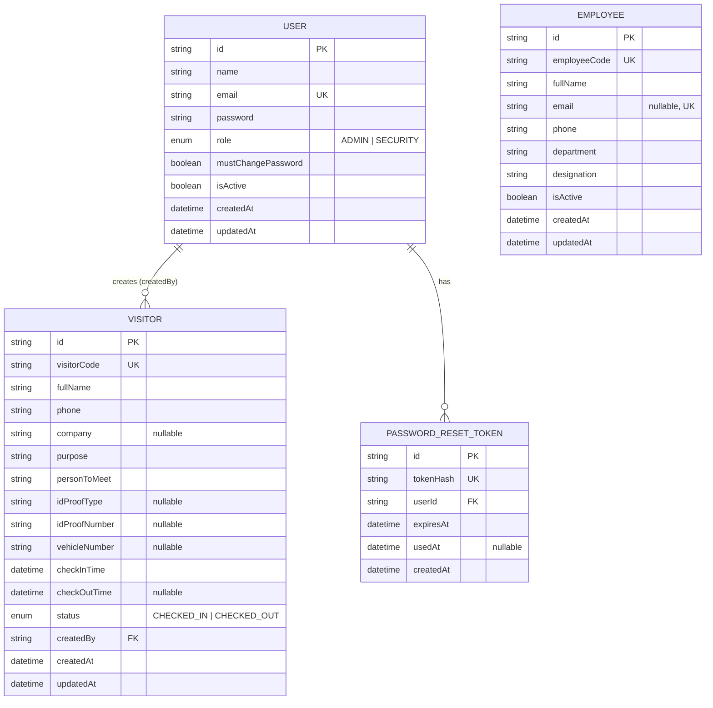

# Invenger VMS — Entity Relationship Diagram

This ER diagram reflects the current PostgreSQL schema defined in `prisma/schema.prisma`.

## ER Diagram

## Relationships

| From | To | Type | Description |
|------|----|------|-------------|
| User | Visitor | 1 : N | One user can create many visitors. `createdBy` is a foreign key. If a user still has visitors, that user cannot be deleted (`onDelete: Restrict`). |
| User | PasswordResetToken | 1 : N | One user can have many reset tokens. If a user is deleted, their tokens are deleted too (`onDelete: Cascade`). |
| Employee | — | standalone | Employee is a separate directory table. Not linked to Visitor yet. `personToMeet` is stored as text. |

## Enums

- **Role:** `ADMIN`, `SECURITY`
- **VisitorStatus:** `CHECKED_IN`, `CHECKED_OUT`

## Backend review status

**Correct / safe for current features:**
- Primary keys and unique fields (`email`, `visitorCode`, `employeeCode`, `tokenHash`)
- User → Visitor foreign key with Restrict (protects visitor history)
- Password reset tokens store hashed token, not plain text
- Optional fields match app rules (`company`, ID proof, employee email)

**Not a bug (by design for now):**
- Employee is not linked to Visitor (`personToMeet` is free text)
- Forgot-password email is optional; Admin reset is the main flow

**Future improvement (not broken today):**
- Add optional `Visitor.employeeId` → `Employee.id` so “Person to Meet” comes from Employees
- Add audit/log tables if management requires history reports
